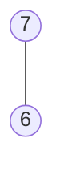
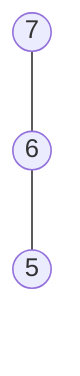
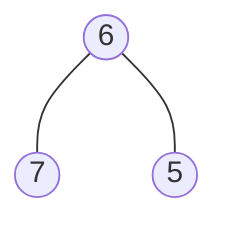
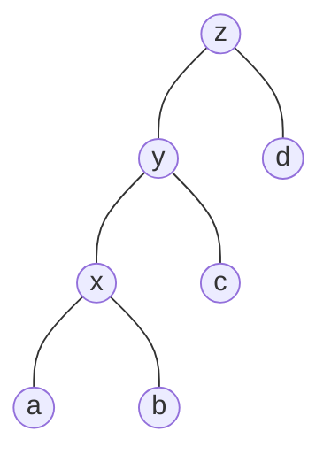
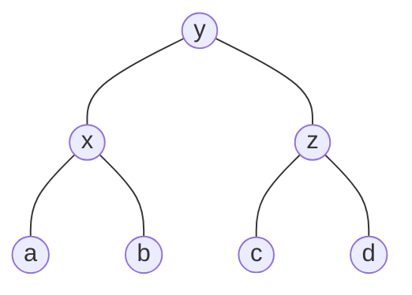
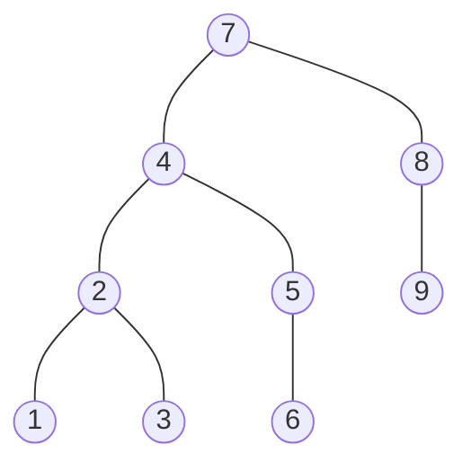
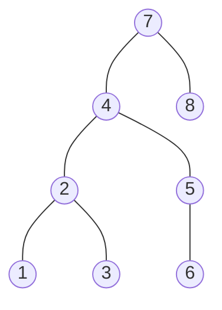
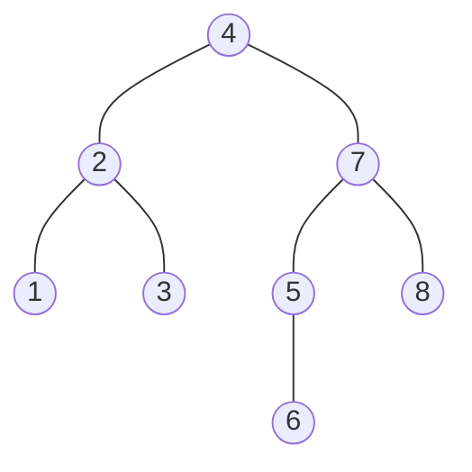
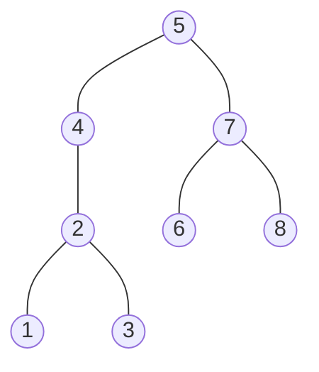

# Lecture 11

CS 240 - June 11, 2019


## AVL Insertion

To perform `AVL::insert(k,v)`:

- First, insert `(k,v)` with the usual BST insertion.
- We assume that this returns the new leaf $z$ where the key was stored
- Then, move up the tree from z, updating heights
  - we assume for this that we have parent-links. This can be avoided if `BST::insert` returns the full path to $z$
- If the height difference becomes $\pm 2$ at node $z$, then $z$ is **unbalanced**. Must re-structure the tree to rebalance.

```pseudocode
AVL::insert(k,v)
	z <- BST::insert(k,v) // leaf where k is now stored
	while (z is not NIL)
		if (|z.left.height - z.right.height| > 1) then
			Let y be taller child of z
			Let z be taller child of y  // break ties arbitrarily
			z <- restructure(x,y,z)
			break
		setHeightFromSubstree(z)
		z <- z.parent

setHeightFromSubtree(u)
	u.height <- 1 + max(u.left.height, u.right.height)
```


### Example

Insert 7, 6, 5 in an empty AVL.

1. insert 7


2. insert 6



7 is still balanced


3. insert 5



7 is not balanced, 6 is still balanced, should end up like this




## Right Rotation



to this




```pseudocode
rotate-right(z)
	y <- z.left, z.left <- y.right, y.right <- z
	setHeightFromSubtree(z), setHeightFromSubtree(y)
	return y // return new root of subtree
```


## AVL Insertion Claim

Let $z$ be the first non-balanced node we find.

Let $T$ be the subtree at $z$.

Let $T'$ be the tree after fixing $z$.

Then,

1. $T'$ is an AVL
2. The height of $T' = \text{height of } T$ before insert. 


## AVL Deletion

- Remove the key $k$ with `BST::delete`
- Find node where structural change happened (this is not necessarily near the node that had $k$.)
- Go back up to root, update heights, and rotate if needed.

```pseudocode
AVL::delete(k)
	z <- BST::delete(k)
	// Assume z is the parent of the BST node that was removed
	while (z is not NIL)
		if (|z.left.height - z.right.height| > 1) then
			Let y be taller child of z
			Let x be taller child of y // break ties to avoid zig-zag
		// always continue up the path and fix if needed
		setHeightFromSubtree(z)
		z <- z.parent
```


### Example

Delete 9






7 is not balanced

choose $z = 7$ and $x = 2$



what if we choose $x = 5$



Not balanced, not an AVL


## AVL Tree Operations Runtime

### search

Just like in BSTs, costs $\Theta(\text{height})$

### insert

`BST::insert`, then check and update along path to new leaf

- total cost $\Theta(\text{height})$
- AVL-fix restores the height of the subtree to what it was
- so AVL-fix will be called at most once.

### delete

`BST::delete`, then check and update along path to deleted node

- total cost $\Theta(\text{height})$
- AVL-fix may be called $\Theta(\text{height})$ times


**Worst-case** cost for all operations is $\Theta(\text{height}) = \Theta(\log n)$

But in practice, the constant is quite large.

