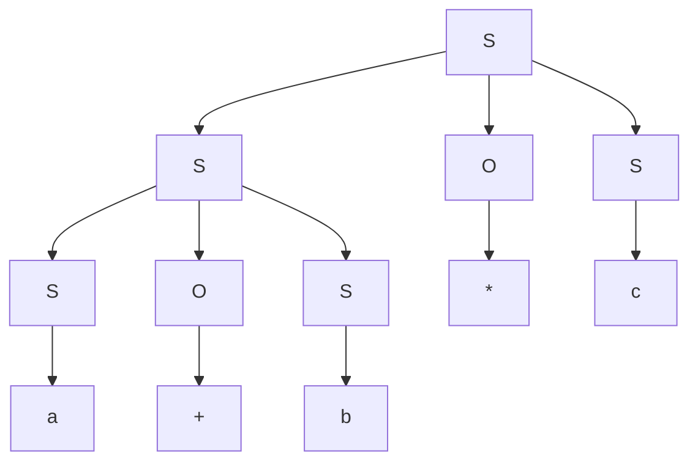
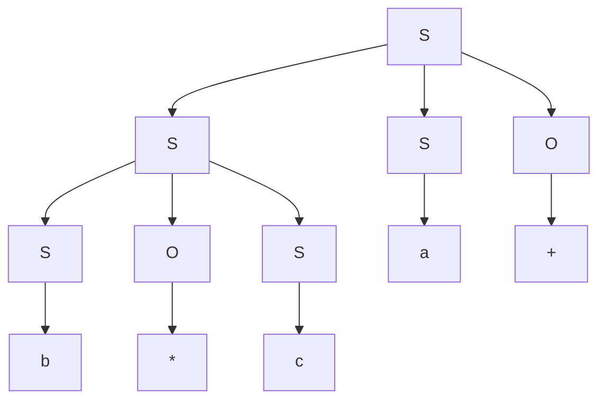
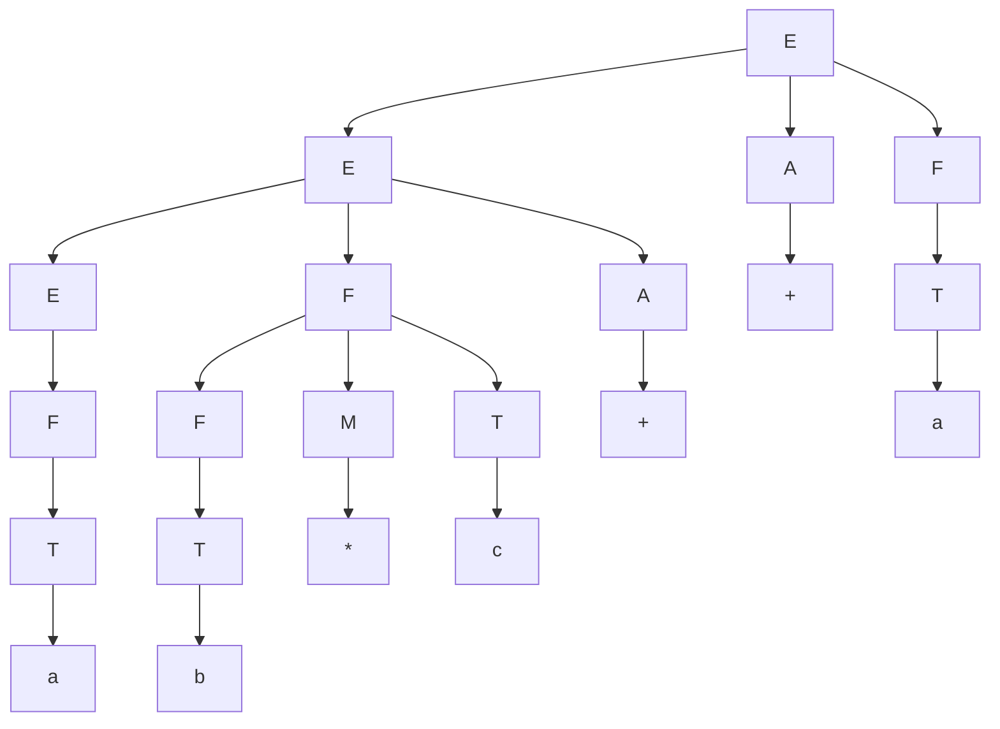

# Lecture 10

CS 241 - June 6, 2019

## Context-Free Grammars

### Example

$S \rightarrow a \mid b \mid c \mid S O S \mid (S)$

$O \rightarrow + \mid - \mid * \mid /$

Derivations: how does the input string get derived? what rules are used?

Dervie $a+b*c$

$S \Rightarrow SOS \Rightarrow SOSOS \Rightarrow aOSOS \Rightarrow a+SOS \Rightarrow a+bOS \Rightarrow a+b*S \Rightarrow a+b*c$

$S \Rightarrow SOS \Rightarrow SOSOS \Rightarrow SObOS \Rightarrow SObOc \Rightarrow aObOc \Rightarrow aOb*c \Rightarrow a+b*c$

$S \Rightarrow SOS \Rightarrow aOS \Rightarrow aOSOS \Rightarrow a+SOS \Rightarrow a+bOS \Rightarrow a+b*S \Rightarrow a+b*c$

### Leftmost Derivation

> Always choose the leftmost non-terminal to expand.

$S \Rightarrow SOS \Rightarrow aOS \Rightarrow a+S \Rightarrow a+SOS \Rightarrow a+bOS \Rightarrow a+b*S \Rightarrow a+b*c$

### Rightmost Derivation

> Always choose the rightmost non-terminal to expand.

### Ambiguity

> Two different leftmost derivations to generate the same string (or rightmost).

### Parse Tree

### $G_2$ Example

$E \rightarrow EOT \mid T$

$T \rightarrow a \mid b \mid c \mid (E)$ 

$O \rightarrow + \mid - \mid * \mid /$

$a+b+c$ evalutes as $(a+b)+c$

but $a+b*c$ ignores math rules, because we don't have operator precedence.

Solution?

1. Use a heuristic to guide derivation by precedence
2. Modify grammar to force precedence

### $G_3$ Example

$E \rightarrow EAF \mid F$

$F \rightarrow FMT \mid T$

$T \rightarrow a \mid b \mid c \mid (E)$

$A \rightarrow + \mid -$

$M \rightarrow * \mid /$

$a+b*c+a$:

$E \Rightarrow EAF \Rightarrow EAFAF \Rightarrow FAFAF \Rightarrow TAFAF \Rightarrow aAFAF \Rightarrow a+FAF \Rightarrow a+FMTAF \Rightarrow …$

$L(G_1) \equiv L(G_2) \equiv L(G_3)$

How d we show $L(G_1) \equiv L(G_2)$?

Equivalence of grammars is undecidable

### Recognizer

What class of computer programs is needed to recognize a CFL:

Regular Language - DFA - finite states/memory

CFL: DFA + stack - infinite memory but in LIFO order

### Parsing

The Problem of finding the derivation is called **parsing**.

Given a grammar $G$, start symbol $S$, terminal string (input) $w$, we want to find the derivation $S \Rightarrow … \Rightarrow w$ or report there is not derivation

How? Two choices:

1. Top-down: Start with $S$, apply rules to get $w$.
2. Bottom-up: Start with $w$, work backwards to get $S$.

### Top-down Parsing

Start with $S$, apply grammar rules to get $w$. $S \Rightarrow \alpha_1 \Rightarrow \alpha_2 \Rightarrow … \Rightarrow w$.

Use stack to store intermediate $\alpha_i$ in reverse and match against characters in $w$.

Invariant: consumed input + reverse(stack contents) = $\alpha_i$

