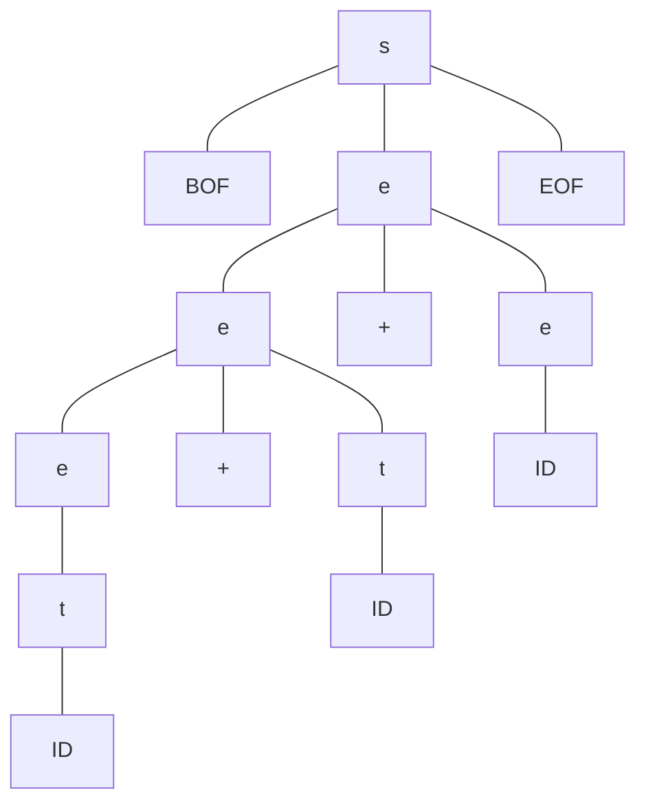
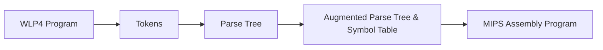

# Lecture 15

CS 241 - June 25, 2019


## SLR(1)

$S' \rightarrow \vdash E \dashv$

$E \rightarrow T + E$

$E \rightarrow T$

$T \rightarrow id$


use a lookahead to try to resolve conflict

$\text{Follow}(T) = \{+, \dashv\}$

$\text{Follow}(E) = \{\dashv\}$


### Interpretation

A reduce Action $A \rightarrow \alpha \cdot$

- where $x = Follow(A)$
- applies only if the next input symbol is in $x$

so $E \rightarrow T \cdot \dashv$  only applies when the next symbol is $\dashv$

and $E \rightarrow T \cdot + E$ only applies when the next symbol is $+$

and $E \rightarrow T \cdot + E$

any other symbol, other than $+, \dashv\ \Rightarrow ERROR$

convlict resolved

Result is called SLR(1) - Simplified LR

LR(1) - more complicated DFA, more states, etc.

LALR - "lookahead LR"

LR still does not work for all grammars

Real World: Yacc / Bison


On the assignment, machines will be specified as follows

series of lines in the format

| State | Symbol                   | Shift/Reduce | Next-state | Production # |
| ----- | ------------------------ | ------------ | ---------- | ------------ |
|       | terminal or non-terminal |              | for shifts | for reduces  |

## Build the Parse Tree

### Top-down Parsing

When you pop $S$ and push $B, y, A$, keep $S$ and make new nodes its children

### Bottom-up Parsing

When you reduce $A \rightarrow ab$ (from a stack with $a$ and $b$), keep the two old symbols as the children as the new node


Your parser ouputs a wlp4 file.

input: $\text{BOF ID + ID + ID EOF}$

$S \rightarrow \text{BOF e EOF}$

$e \rightarrow e + t$

$e \rightarrow t$

$t \rightarrow ID$



```pseudocode
S BOF e BOF
BOF BOF
e e + t
e e + t
e t
t ID
ID a
+ +
t ID
ID b
+ +
t ID
ID c
EOF EOF
```

## Context-Sensitive Analysis

- what properties of C programs cannot be enforced by a CFG?
  - type checking
  - declared before use - variables and functions
  - checking function signatures
  - multiple definitions

to identify/check these, we need more complex programs.

context-sensitive langauges



From WLP4 to Tokens:

- scanner
- lexical analysis
- Regular Languages

From Tokens to Parse Tree:

- Parsing
- Syntatic Analysis
- CFGs
- CFLs

Parse Tree to Augmented Parse Tree & Symbbol Table:

- semantic analysis
- context-sensitive

Augmented Parse Tree & Symbbol Table to MIPS Assmbly:

- code generation