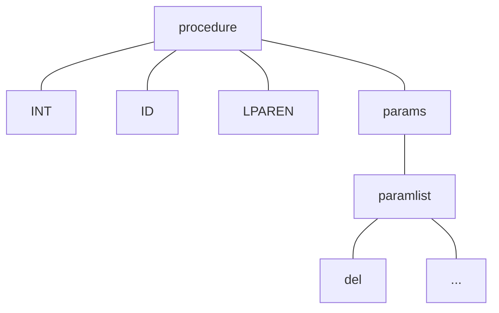

# Lecture 16

CS 241 - June 27, 2019

## Context Sensitive Analysis

- Typoe checkings
- Variable/function declarations
  - missing/multiple
- Scope


### Parse Tree

```c++
class Tree {
  public:
  	string rule; // eg "expr expr PLUS term"
  	vector<string> tokens; // eg "expr", "expr", "PLUS", "term"
  	vector<Tree> children;
};
```

### Tree Traversal

```c++
void doSomething(const Tree &t) {
  // do something with t
  for (const auto &i:t.children) {
    doSomething(i);
  }
}
```

### Build Symbol Table

- Traverse the parse tree to collect variable declarations
  - for each node corresponding to the rule: `dcl -> TYPE ID`
    - extend ID's name (e.g. x) and type (int or int* only in WLP4) and add it to the symbol table
  - if name already exists in the table => ERROR
  - multiple declarations checked
- Traverse parse tree and check for `factor -> ID` and `lvalue -> ID`
  - if ID's name is not in the symbol table, ERROR
  - undefined variabbles checked
- You must do these all in one pass

### Implementing Symbol Table

- `map`
- global variable
- `map<string,string> symbolTable; //name -> type`

#### Issues

```c++
int f() {
  int x = 0;
  int y = 0;
  return x;
}

int wain(int a, int b) {
  int x = 0; // okay
  return x;
}
```

- doesn't account for scope or procedures
- permit duplicated declarations in different procedures
- forbid duplicate declarations in the same procedures

```c++
int f() {...}
int f() {...} // Not okay
```

need a separate symbol table for each procedure


Have a "top-level" symbol table taht stores all procedure names

`map<string,map<string,string>> topSymbolTable;`

map<procedure name, symbolTable>


When traversing the parse tree

- Find node corresponding to rule:
  -  `procedure -> INT ID LPAREN ...`
  - `main -> INT WAIN ...`

- new procedure
  - make sure its name not already in symbol table
  - if not, create a new entry

Implementation: may want a global variable to store "current procedure"

- update each time we find
  - `procedure -> ...`
  - `main -> ...`

For variables, store declared type and name in symbol table

Do procedures have a type? Yes - signatures.

- return type - for WLP4 is only INT
- parameter types
- so signature is only param list types


Store this in the top-level symbol table

`map<string,pair<vector<string>,map<string,string>>> topSymbolTable`;

map<procedure name, pair<signature, symbolTable>>


To compute the signature:



- `paramlist -> dcl`
- `paramlist -> dcl COMMA paramlist`
- if `params ->`, then signature is empty

Types: why do programming languages have types?

- Recall: from only bits - don't know what they represent
- types tells us how to interpret the bits
- a good type system prevent us from re-interpreting the bits as something else

#### Example

```c++
int *p = NULL;
p = 7;
```

- casting

WLP4, two types: `int` and `int*`

To check type correctness, need to

- determine the type associated with each variable/expression
- ensure that all operators are applied to operands of the correct type

how do we determine type?

- declarations
- `del -> TYPE ID`
- add a field in the symbol table

catching type ERRORS

- determine the type of every expression by applying type rules given by language spec
- if no rule applicable, or if an expression type does not match its context -> ERROR

```pseudocode
string typeof(Tree &t) {
  for each c in t.children:
  	compute typeof(c)
  use t.rule to decide what type rule is relevant
  	combine types of children
  	determine the type of t
  	if not possible: ERROR
}

string typeof(Tree &t) {
	if t.rule == "ID NAME" {
		return symboltable.lookup(name);
	}
}
```

