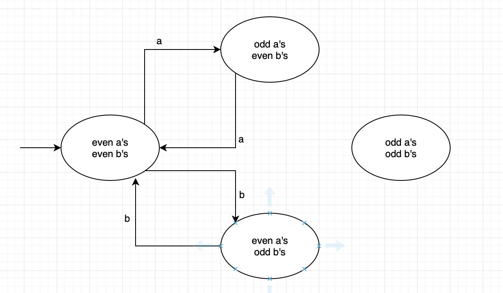
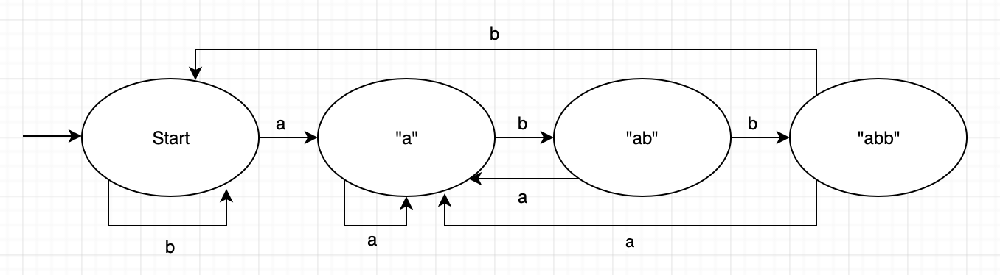
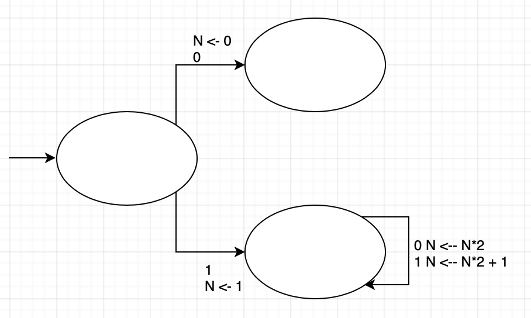
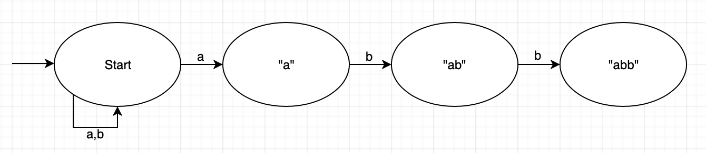
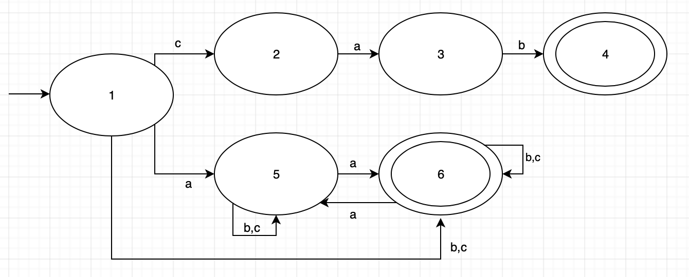

# Lecture 7

CS 241 - May 28, 2019

## DFA

### Example

$\Sigma = \{\text{a,b}\}$, give DFA for $L = \{\text{even number a's, odd number b's}\}$

How many states do you need?

What do they represent?



### Example

Give DFA for $L=\{w \in \{a,b\}*\},w \text{ ends in } abb$ 



## DFA with actions

### Example

$L=\{\text{binary numbers with no leading zeros}\}$

- Simultaneously compute value $N$ (in decimal)



CS 241 we want to build a scanner (tokenizer)

- action: "emit a token", build its lexeme

## Kleene's Theorem

> A language $L$ is regular $\Longleftrightarrow L = L(M)$ for some DFA $M$.

Recall: the notation $L(M)$ denotes the language of automata $M$. A DFA $M = (\Sigma, Q, q_0, A, \delta)$

## Nondeterministic Finite Automata (NFA)

> An NFA allows more than 1 transition on a given alphabet symbol from a state.

### Example

Give NFA for $L=\{w \in \{a,b\}*\},w \text{ ends in } abb$ 



Which path to fllow?

If in start state, input char is a, where do you go?

$S(start,a) \rightarrow\ ?$

Two choices:

1. stay in start state
2. goto "a"

Nondeterministic "magic" - the machine always makes the correct choice of path to follow

## Formal Definition - NFA

> Formally a **NFA** $M$ is a 5-tupple $M = (\Sigma, Q, q_0, A, \delta)$
>
> - $\Sigma$: non-empty, finite alphabet
> - $Q$: non-empty, finite set of states
> - $q_0$: start state
> - $A \subseteq Q$: set of accepting states
> - $\delta : (Q \times\Sigma) \rightarrow Q$ : **Subset of** $Q, 2^{|Q|}$ possible subsets.

Accept if there exists at least one path through $M$ that leads to an accepting state; reject if no such path exists.

**Note**: this doesn't help us choose the correct path.

## Acceptance in an NFA

$\delta ^*(\text{subset of }Q \times \Sigma ^*) \rightarrow \text{subset of }Q$

Base Case: $\delta ^*(q_{subset}, \epsilon) = \text{subset of }Q$

Recursive Case: $\delta ^*(q_{subset}, cw) = \delta ^*(\bigcup _{q \in q_{subset}}\delta(q,c),w)$

**Acceptance**: FNA $M$ accepts $w \text{ if } \delta ^*(\{q_0\}, w) \cap A \ne \empty$

## Simulating an NFA

```pseudocode
states = {q0}
while NOT EOF do
	read ch
	states = Union(delta(q, ch) for each q in states)
end while
if states INTERSECT A != NULL
	Accept
else
	Reject
```

## Converting an NFA to an DFA

### Example

$L = \{\text{cab or strings with even numbers of a's}\}, \Sigma = \{\text{a,b,c}\}$

#### NFA



