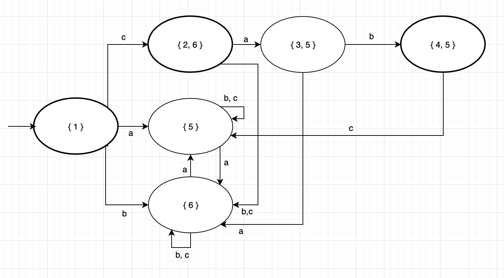
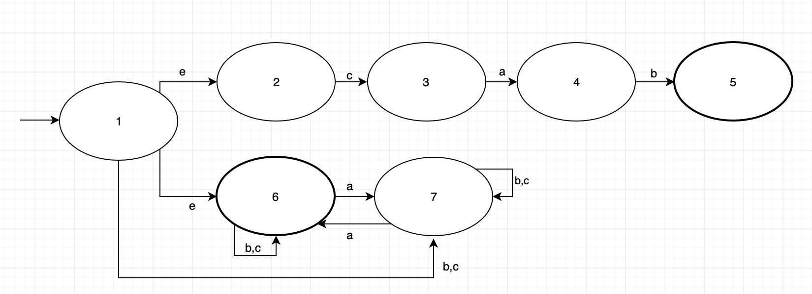
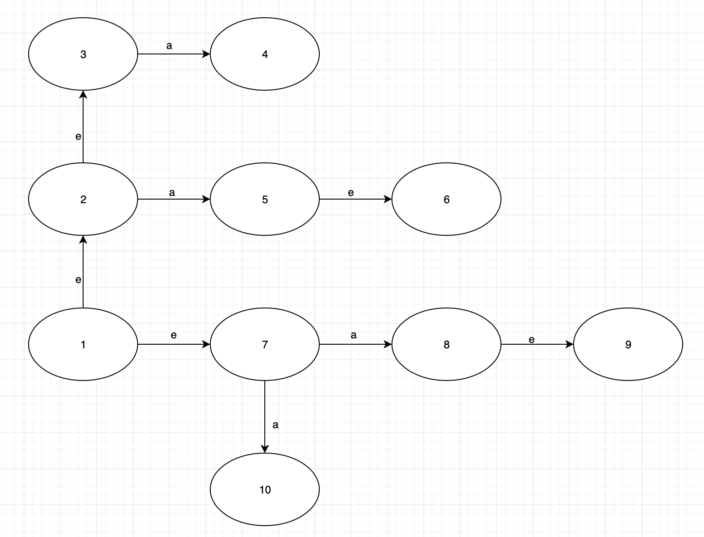
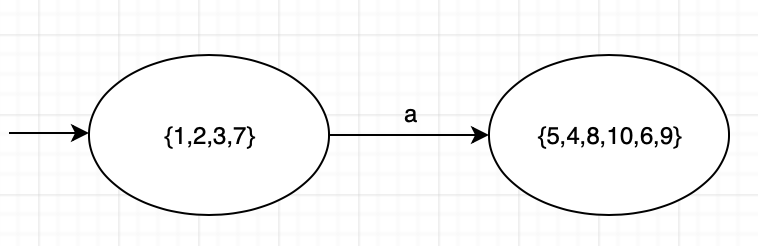

# Lecutre 8

CS 241 - May 30, 2019

## Converting an NFA to an DFA

### Example

$L = \{\text{cab or strings with even numbers of a's}\}, \Sigma = \{\text{a,b,c}\}$

#### NFA

#### DFA

## $\epsilon$-NFA

> An **${\epsilon}$-NFA** extends NFAs by also allowing a change of state on $\epsilon$, the empty string; i.e. a change of state by $\epsilon$-transition does not consume an alphabet symbol.

### Example

### Trace

| Read       | Not Read   | States   |
| ---------- | ---------- | -------- |
| $\epsilon$ | caba       | 1,2,6    |
| c          | aba        | 3,6      |
| ca         | ba         | 4,7      |
| cab        | a          | 5,7      |
| caba       | $\epsilon$ | 6 accept |

### Example

#### $\epsilon$-DFA

#### Transition Function

$\delta: (q,a) \rightarrow \text{ set of states}$

$\delta: (1,a) \rightarrow \empty$

$\delta: (2,a) \rightarrow \{5\}$

$\delta: (3,a) \rightarrow \{4\}$

$\delta: (7,a) \rightarrow \{8,10\}$

I could follow $\epsilon$-transitions after these states

$\epsilon \text{-closure}(\{5,4,8,10\}) \rightarrow \{5,4,8,10,6,9\}$

#### $\epsilon \text{-closure}(\{1\}) $

$\text{0 } \epsilon \text{-move: } \{1\}$

$\text{1 } \epsilon \text{-move: } \{2,7\}$

...

union all the above yields $\{1,2,7,3\}$

so $\epsilon \text{-closure}(\{1\}) \rightarrow \{1,2,7,3\}$

#### DFA

## Language of NFAs

- Every DFA is an NFA with only a single choice of transition at each state
- Every NFA can be converted to a DFA

## Convert $\epsilon$-NFA to a DFA

We use the same technique as NFA to DFA

- same basic idea but must consider the $\epsilon$-closure of sets of states
- start with the $\epsilon$-closure of the start state - this subset of states is the labbel for the start state of the DFA
- then determine the $\epsilon$-closure of the set of state reachable on each alphabet symbol, etc.

## Scanning

$\{\text{sequence of C tokens that are valid programs}\} \subseteq LL^*$

Is a subset of a Regular Language, Regular?