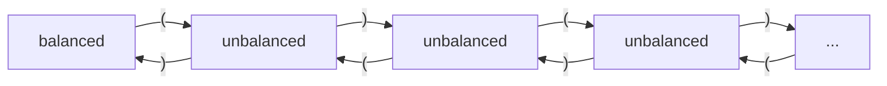

# Lecture 9

CS 241 - June 4, 2019

## Unique Decomposition

>To remove decomposition ambiguity, we could decide to only take the $\epsilon$-transition (emit token) when there is no other choice. This emits the longest possible token at iteration.

## Maximul Munch Algoirthm

- Run DFA until non=error transitions available
- If in an accepting state, emit token found. Else backup DFA to most recently seen accepting state, emit token, resume from here.
- $\epsilon$-transition back to start state

Implementation: will need a variable to track most recent accepting state.

## Simplified Maximul Munch

Same as Maximal Munch except: if **not** in accepting state when no non-error transitions availabble, simply crash (ERROR) - no backtracking.

- Run DFA until no non-error transitions availabble
- If in an accepting state, emit token found, $\epsilon$-transition back to start state. Else ERROR.

### Example

$\Sigma=\{\text{(,)}\}, L=\{\text{strings of balanced parentheses}\}$

If there is no limit on number of nextings, we need an inifinite number of states, this is not a DFA.

## Context-free Languages

- languages that can be described by a context free grammar, i.e. a set of rewriting rules.

### Intuition

$S \rightarrow (\ S\ )$

$S \rightarrow \epsilon$

$S \rightarrow SS$

$S \rightarrow (\ S\ ) \rightarrow ((\ S\ )) \rightarrow ((\ \epsilon\ )) \rightarrow ((\ ))$

## Context-Free Grammars (CFG)

Formally, a CFA $G$ is a 4-tuple $G = (\Sigma, N, P, S)$

- $\Sigma$: non-empty, finite alphabet of terminal symbols
- $N$: non-empty, finite set of non-terminals (often also called variables)
- $P$: a finite set of production rules of the form
  - $A \rightarrow \beta \text{ where } A \in N, \beta \in (N \cup \Sigma)^*$
- $S$: a start non-terminal, $S \in N$

> we frequently use $(N \cup \Sigma)$, and we denote it as $V$ for "vocabulary"; e.g. $V^* = (N \cup \Sigma)^*$.

### Notation

> Shortform: Multiple rules with the same *lefthand side* (LHS), can be written on a single line with the *righthand sides* (RHS) separated by | (meaning OR).

$S \rightarrow (\ S\ )$

$S \rightarrow \epsilon$

$S \rightarrow SS$

Shortform: $S \rightarrow \epsilon\ |\ (S)\ |\ SS$

### Conventions

- early lowercase letters: $a,b,c,…$ are symbols from $\Sigma$
- late lower case letters: $…,w,x,y,z$ are symbols from $\Sigma^*$
- uppercase letters: $A,B,…,S,…$ are non-terminals from $N$
- $S$ is the start non-terminal
- Lowercase greek letters: $\alpha, \beta, \gamma,…$ are elements of $V^*$ used in the RHS of production rules which may contain both terminals and non-terminals

### Derivations

> The application of production rules is called a **derivation**; ie.e from some initial form, we apply a production rule to obtain the next form. The symbol $\Rightarrow$ means "derives".

- $\alpha \Rightarrow \beta$ means $\beta$ can be derived from $\alpha$ by the application of one production rule
- $\alpha \Rightarrow^k \beta$ means $\beta$ can be derived from $\alpha$ by the application of $k$ production rules
- $\alpha \Rightarrow^* \beta$ means $\beta$ can be derived from $\alpha$ by the application of 0 or more production rule

Example: $\alpha \Rightarrow^k \beta$ means $\alpha = \delta_0 \Rightarrow \delta_1 \Rightarrow … \Rightarrow \delta_k = \beta$

### Intermediate Forms

> We typically start from $S$ and apply production rules until a word $w$ of only terminals is derived. The intermediate strings, however, may contain both terminals and non-terminals.

i.e. $S \Rightarrow^* w$ where $S \in N$ and $w \in \Sigma^*$

Intermediate steps may have the form:

$\alpha A \beta \Rightarrow \alpha \gamma \beta$ if there is a production $A \rightarrow \gamma$ in $P$.

- $\alpha, \beta, \gamma \in V^* = (N \cup \Sigma)^*$ and $A \in N$
- RHS is derivable from LHS in one step

> Know your notation: do not confuse $\Rightarrow$ with $\rightarrow$.

### Language of a CFG $G$

> The language of **CFG** $G$ is the set of strings (terminals only) that we can be derived from the starting non-terminal $S$
>
> i.e. $L(G) = \{w \in \Sigma^* | S \Rightarrow^* w\}$

A language *L* is context-free if $L = L(G)$ for some CFG $G$.

The language $L = \{\text{strings of balanced parentheses}\}$ is context-free

- CFG $G: S \rightarrow \epsilon\ |\ (S)\ |\ SS$
- $L = L(G)$

### Example

Palindromes

$S \rightarrow \epsilon$

$S \rightarrow a|b|c$

$S \rightarrow aSa\ |\ bSb\ |\ cSc$

Show $abcba$ is in $L(G)$

$S \Rightarrow aSa \Rightarrow abSba \Rightarrow abcba$

show $abc$ is not in $L(G)$

### Example

$\Sigma_1 = \{\text{ a,b,c,+,-,*,/ }\}$

$L_1 = \{\text{ arithmetic expressions on } \Sigma_1\}$

$S \rightarrow a|b|c|SOS$

$O \rightarrow +|-|*|/$

$\Sigma_2 = \Sigma_1 \cup \{\text{ (,) }\}$

$L_2 = \{\text{.arithmetic expression over  } \Sigma_2\}$

